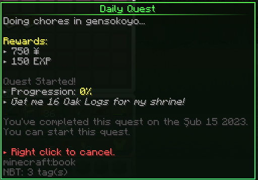

# Getting money

"_See that shiny gold coin next to your hunger bar? Text that says `¥0.00`? That's your balance! Yup. That means you're broke! It's time to earn some money!" -cheese_

Money is measured in Yen (¥), the currency used in Japan. You don't need to know much else about it really, besides the fact that it's also the currency used here in Gensokyo.

There are three primary methods of acquiring money: [fishing](getting-money.md#fishing), [selling items](getting-money.md#selling-items), and [quests](getting-money.md#quests).

## Fishing

Cast a line and relax by the water, try and catch a fish or two. Or instead, get on the grindset and get that hard earned cash!

To start, you'll need a fishing rod. Cast out a line, and wait. Fun fact: there will be a lot of waiting. Once something bites, you'll enter a little minigame. There'll be a line that moves across a bar, and you'll have to right click when it enters a green section of the bar (unless otherwise specified, e.g. when it says "YELLOW!"). Successfully completing the minigame will give you one of the many different types of fish, or loot, if you're lucky.

List of fish and sell values (WIP)

Each type of fish has a different value that they can be sold at. Values in <mark style="color:blue;">blue</mark> are for Silver Star rarities. Values in <mark style="color:yellow;">yellow</mark> are for Gold Star rarities.

* Cod (¥10)
* Salmon (¥10)
* Pufferfish (¥10)
* Garbage (N/A)
* Sardine (¥13.40, <mark style="color:blue;">¥16.40</mark>)
* Woodskip (<mark style="color:blue;">¥19.50</mark>)
* Sunfish (¥11.50, <mark style="color:yellow;">¥27.50</mark>)
* Carp (¥000, <mark style="color:blue;">¥13.10</mark>)
* Tuna (<mark style="color:yellow;">¥50.60</mark>)
* Red Snapper (¥12.30)

Selling fish is a different process from selling resources. To sell fish, use the command `/sellfish`.&#x20;

<figure><figcaption>
A fishing demo by yours truly! Look at that skill! The finesse!
</figcaption></figure>

## Selling items

You're probably going to get lots of resources as you survive. Probably more than you'll actually use. Some of these resources can be sold for money, allowing you to go and purchase other things you might need instead!

To sell items, head to Hakurei Shrine and find Rinnosuke. Find and item that is eligible to sell, and right click it. Use the GUI to increase or decrease the amount to sell, then hit confirm. Alternatively, you can middle click the item to instantly sell all of it.

Most sellable items include: ores, crops, seeds, and mob drops.

_Check out_ [_The Caverns_](the-caverns-wip.md) _for more details on mining and ore!_

<figure><figcaption>
Selling 8 redstone dust for ¥8.
</figcaption></figure>

<figure><figcaption>
Arrows can be sold for ¥5 each!
</figcaption></figure>

## Quests

As of right now, there are very limited quests (they're still WIP). Quests will be simple tasks, that reward you with money. To start, visit Hakurei Shrine and talk to Reimu (otherwise known as the Quest Master). There, she will offer several quests, each with a different task to fulfill.&#x20;

The most notable quest is the daily quest. You can complete it every day to earn a sizable amount of money (for the amount of work it takes to finish it).&#x20;

To start a quest, simply left click any of quests.

<figure><figcaption>
The daily quest: do some chores! Chop some wood, stab some zombies. Get to it!
</figcaption></figure>
