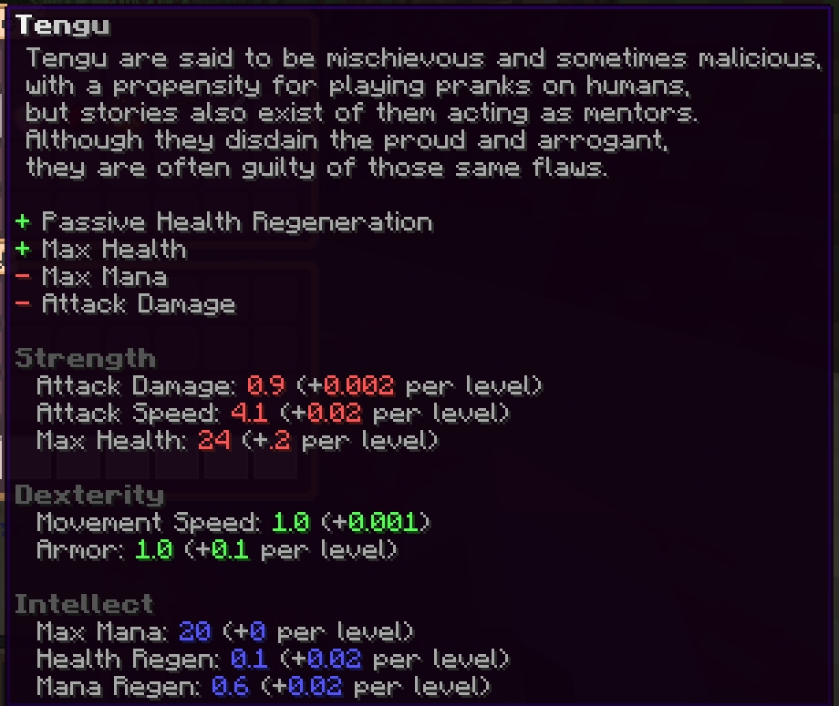
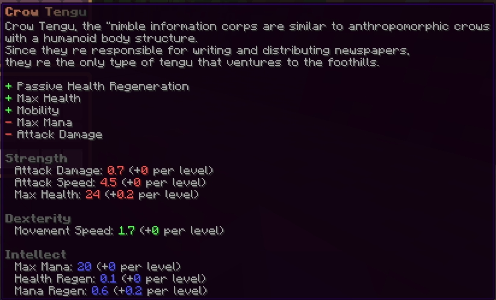
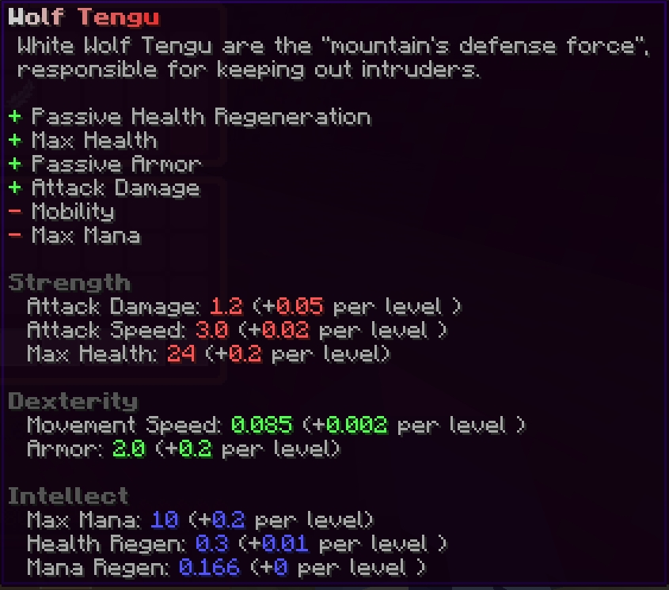

# ✨ Our Features

## Custom Weather Seasons/Events

We've very fast and super flexiable weather system and weather events with temprature to make survival little bit intresting :sparkles:

<figure><figcaption>
Winter and Spring
</figcaption></figure>

## Unlimited Deeper World

We all know gensokyo has a lot of verticality. With this feature we can add unlimitted sections to a world that teleports and syncs! (it also syncs minecarts)


Demo of that feature


## Custom Fishing

Pretty self explanatory but with this plugin there are more than 20+ fish to catch and sell!

<figure><figcaption>
Fishing minigame
</figcaption></figure>

<figure><figcaption>
Selling the fishes
</figcaption></figure>

## Custom Classes

You can choose your class accordingly to races in touhou!

<figure><figcaption>
Tengu class
</figcaption></figure>

<figure><figcaption>
Sub Classes of Tengu
</figcaption></figure>

 

<figure><figcaption></figcaption></figure>

## Custom Crops

There are 10 custom crops as well as watering system and crops getting effected by seasons!

<figure><figcaption>
Crops, Sprinklers and scarecrow!
</figcaption></figure>

